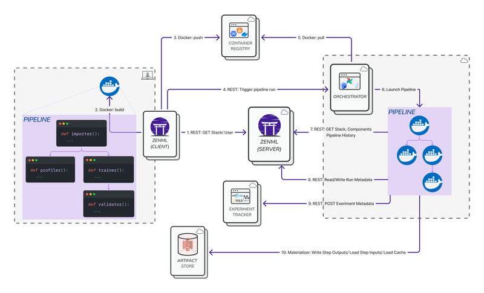

Experiment trackers let you track your ML experiments by logging extended information about your models, datasets, metrics, and other parameters and allowing you to browse them, visualize them and compare them between runs. In the ZenML world, every pipeline run is considered an experiment, and ZenML facilitates the storage of experiment results through Experiment Tracker stack components. This establishes a clear link between pipeline runs and experiments.

Related concepts:

* the Experiment Tracker is an optional type of Stack Component that needs to be registered as part of your ZenML [Stack](../../user-guide/guides/production-guide/understand-stacks.mdx).
* ZenML already provides versioning and tracking for the pipeline artifacts by storing artifacts in the [Artifact Store](/stack-components/artifact-stores).

### When to use it

ZenML already records information about the artifacts circulated through your pipelines by means of the mandatory [Artifact Store](/stack-components/artifact-stores).

However, these ZenML mechanisms are meant to be used programmatically and can be more difficult to work with without a visual interface.

Experiment Trackers on the other hand are tools designed with usability in mind. They include extensive UIs providing users with an interactive and intuitive interface that allows them to browse and visualize the information logged during the ML pipeline runs.

You should add an Experiment Tracker to your ZenML stack and use it when you want to augment ZenML with the visual features provided by experiment tracking tools.

### How they experiment trackers slot into the stack

Here is an architecture diagram that shows how experiment trackers fit into the overall story of a remote stack.

<Frame caption="Experiment Tracker">
  
</Frame>

#### Experiment Tracker Flavors

Experiment Trackers are optional stack components provided by integrations:

| Experiment Tracker                                                    | Flavor   | Integration | Notes                                                                                           |
| --------------------------------------------------------------------- | -------- | ----------- | ----------------------------------------------------------------------------------------------- |
| [Comet](comet.mdx)                  | comet    | comet       | Add Comet experiment tracking and visualization capabilities to your ZenML pipelines            |
| [MLflow](mlflow.mdx)                | mlflow   | mlflow      | Add MLflow experiment tracking and visualization capabilities to your ZenML pipelines           |
| [Neptune](neptune.mdx)              | neptune  | neptune     | Add Neptune experiment tracking and visualization capabilities to your ZenML pipelines          |
| [Weights & Biases](wandb.mdx)       | wandb    | wandb       | Add Weights & Biases experiment tracking and visualization capabilities to your ZenML pipelines |
| [Custom Implementation](custom.mdx) | _custom_ | _custom_    |                                                                                                 |

If you would like to see the available flavors of Experiment Tracker, you can use the command:

```bash
zenml experiment-tracker flavor list
```

### How to use it

Every Experiment Tracker has different capabilities and uses a different way of logging information from your pipeline steps, but it generally works as follows:

* first, you have to configure and add an Experiment Tracker to your ZenML stack
* next, you have to explicitly enable the Experiment Tracker for individual steps in your pipeline by decorating them with the included decorator
* in your steps, you have to explicitly log information (e.g. models, metrics, data) to the Experiment Tracker same as you would if you were using the tool independently of ZenML
* finally, you can access the Experiment Tracker UI to browse and visualize the information logged during your pipeline runs. You can use the following code snippet to get the URL of the experiment tracker UI for the experiment linked to a certain step of your pipeline run:

```bash
from zenml.client import Client

pipeline_run = Client().get_pipeline_run("")

step = pipeline_run.steps[""]

experiment_tracker_url = step.run_metadata["experiment_tracker_url"].value
```
<Info>
  Experiment trackers will automatically declare runs as failed if the corresponding ZenML pipeline step fails.
</Info>

Consult the documentation for the particular [Experiment Tracker flavor](/stack-components/experiment-trackers#experiment-tracker-flavors) that you plan on using or are using in your stack for detailed information about how to use it in your ZenML pipelines.
