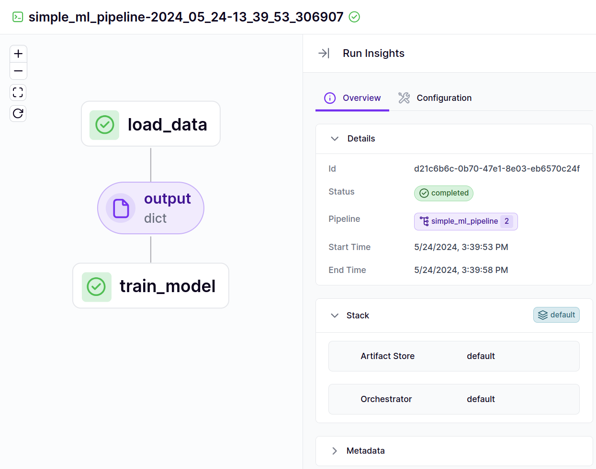

```py
@step  # Just add this decorator
def load_data() -> dict:
    training_data = [[1, 2], [3, 4], [5, 6]]
    labels = [0, 1, 0]
    return {'features': training_data, 'labels': labels}


@step
def train_model(data: dict) -> None:
    total_features = sum(map(sum, data['features']))
    total_labels = sum(data['labels'])

    # Train some model here

    print(f"Trained model using {len(data['features'])} data points. "
          f"Feature sum is {total_features}, label sum is {total_labels}")


@pipeline  # This function combines steps together
def simple_ml_pipeline():
    dataset = load_data()
    train_model(dataset)
```

You can now run this pipeline by simply calling the function:

```Bash
simple_ml_pipeline()
```

When this pipeline is executed, the run of the pipeline gets logged to the ZenML dashboard where you can now go to look at its DAG and all the associated metadata. To access the dashboard you need to have a ZenML server either running locally or remotely. See our documentation on this [here](/getting-started/deploying-zenml).
<Frame caption="DAG representation in the ZenML Dashboard.">
  
</Frame>

Check below for more advanced ways to build and interact with your pipeline.

<CardGroup cols={2}>
 <Card title="Configure pipeline/step parameters" icon="gear" href="use-pipeline-step-parameters.mdx" horizontal />

<Card title="Name and annotate step outputs" icon="tag" href="step-output-typing-and-annotation.mdx" horizontal />

<Card title="Control caching behavior" icon="database" href="control-caching-behavior.mdx" horizontal />

<Card title="Run pipeline from a pipeline" icon="play" href="https://github.com/zenml-io/zenml/blob/release/0.66.0/docs/book/usage/pipelines/build-pipelines/trigger-a-pipeline-from-another.md" horizontal />

<Card title="Control execution order of steps" icon="list-ol" href="control-execution-order-of-steps.mdx" horizontal />

<Card title="Customize step invocation IDs" icon="fingerprint" href="using-a-custom-step-invocation-id.mdx" horizontal />

<Card title="Name your pipeline runs" icon="signature" href="name-your-pipeline-and-runs.mdx" horizontal />

 <Card title="Use failure/success hooks" icon="basketball" href="use-failure-success-hooks.mdx" horizontal />

<Card title="Hyperparameter tuning" icon="sliders" href="hyper-parameter-tuning.mdx" horizontal />

<Card title="Attach metadata to steps" icon="tags" href="../../resource-data-management/track-metrics-metadata/attach-metadata-to-steps.mdx" horizontal />

<Card title="Fetch metadata within steps" icon="download" href="../../resource-data-management/track-metrics-metadata/fetch-metadata-within-steps.mdx" horizontal />

 <Card title="Fetch metadata during pipeline composition" icon="code" href="../../resource-data-management/track-metrics-metadata/fetch-metadata-within-pipeline.mdx" horizontal />
 <Card title="Enable or disable logs storing" icon="toggle-on" href="../../development-monitoring/control-logging/enable-or-disable-logs-storing.mdx" horizontal />
 <Card title="Special Metadata Types" icon="star" href="../../resource-data-management/track-metrics-metadata/logging-metadata.mdx" horizontal />
 <Card title="Access secrets in a step" icon="key" href="access-secrets-in-a-step.mdx" horizontal />
 </CardGroup>
