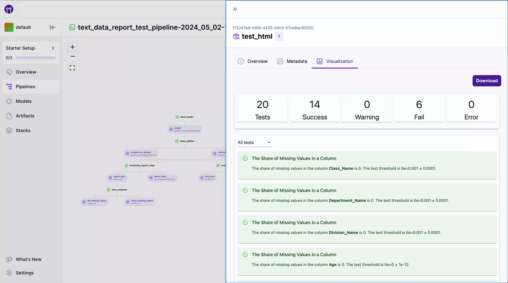

ZenML automatically saves visualizations of many common data types and allows you to view these visualizations in the ZenML dashboard:
<Frame caption="A simple artifact exchange between two pipelines">
  
</Frame>

Alternatively, any of these visualizations can also be displayed in Jupyter notebooks using the `artifact.visualize()` method:
<Frame caption="output.visualize() Output">
  
</Frame>

Some examples of default visualizations are:

* A statistical representation of a [Pandas](https://pandas.pydata.org/docsversions/0.66.0/reference/api/pandas.DataFrame.html) Dataframe represented as a png image.
* Drift detection reports by [Evidently](../../../stack-components/data-validators/evidently.mdx), [Great Expectations](../../../stack-components/data-validators/great-expectations.mdx), and [whylogs](../../../stack-components/data-validators/whylogs.mdx).
* A [Hugging Face](https://zenml.io/integrations/huggingface) datasets viewer embedded as a HTML iframe.
<Frame caption="output.visualize() output for the Hugging Face datasets viewer">
  
</Frame>

