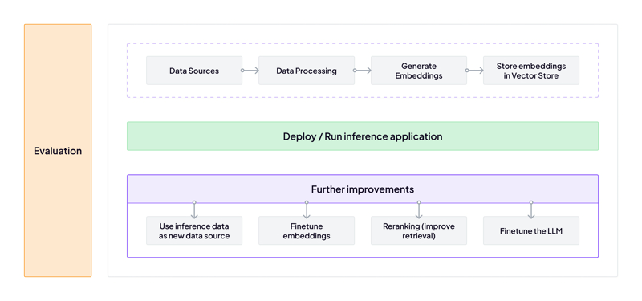

Welcome to the ZenML LLMOps Guide, where we dive into the exciting world of Large Language Models (LLMs) and how to integrate them seamlessly into your MLOps pipelines using ZenML. This guide is designed for ML practitioners and MLOps engineers looking to harness the potential of LLMs while maintaining the robustness and scalability of their workflows.
<Frame caption="ZenML simplifies the development and deployment of LLM-powered MLOps pipelines.">
  
</Frame>

In this guide, we'll explore various aspects of working with LLMs in ZenML, including:

<Card title="RAG with ZenML" icon="robot" href="llmops-guide/rag-with-zenml.mdx" horizontal/>
<CardGroup cols={2}>
  <Card title="RAG in 85 lines of code" icon="code" href="llmops-guide/rag-with-zenml/rag-85-loc.mdx" horizontal/>
  <Card title="Understanding RAG" icon="book" href="llmops-guide/rag-with-zenml/understanding-rag.mdx" horizontal/>
  <Card title="Data ingestion and preprocessing" icon="database" href="llmops-guide/rag-with-zenml/data-ingestion.mdx" horizontal/>
  <Card title="Embeddings generation" icon="vector-square" href="llmops-guide/rag-with-zenml/embeddings-generation.mdx" horizontal/>
  <Card title="Storing embeddings in a vector database" icon="server" href="llmops-guide/rag-with-zenml/storing-embeddings-in-a-vector-database.mdx" horizontal/>
  <Card title="Basic RAG inference pipeline" icon="diagram-project" href="llmops-guide/rag-with-zenml/basic-rag-inference-pipeline.mdx" horizontal/>
</CardGroup>
---
<Card title="Evaluation and metrics" icon="chart-line" href="llmops-guide/evaluation.mdx" horizontal/>
<CardGroup cols={2}>
  <Card title="Evaluation in 65 lines of code" icon="code" href="llmops-guide/evaluation/evaluation-in-65-loc.mdx" horizontal/>
  <Card title="Retrieval evaluation" icon="magnifying-glass" href="llmops-guide/evaluation/retrieval.mdx" horizontal/>
  <Card title="Generation evaluation" icon="wand-magic-sparkles" href="llmops-guide/evaluation/generation.mdx" horizontal/>
  <Card title="Evaluation in practice" icon="flask" href="llmops-guide/evaluation/evaluation-in-practice.mdx" horizontal/>
</CardGroup>

---
<Card title="Reranking for better retrieval" icon="ranking-star" href="llmops-guide/reranking.mdx" horizontal/>

<CardGroup cols={2}>
  <Card title="Understanding reranking" icon="book" href="llmops-guide/reranking/understanding-reranking.mdx" horizontal/>
  <Card title="Implementing reranking in ZenML" icon="code" href="llmops-guide/reranking/implementing-reranking.mdx" horizontal/>
  <Card title="Evaluating reranking performance" icon="chart-line" href="llmops-guide/reranking/evaluating-reranking-performance.mdx" horizontal/>
</CardGroup>
---
<Card title="Improve retrieval by finetuning embeddings" icon="bullseye-arrow" href="llmops-guide/finetuning-embeddings.mdx"horizontal/>
<CardGroup cols={2}>
  <Card title="Synthetic data generation" icon="robot" href="llmops-guide/finetuning-embeddings/synthetic-data-generation.mdx" horizontal/>
  <Card title="Finetuning embeddings with Sentence Transformers" icon="brain" href="llmops-guide/finetuning-embeddings/finetuning-embeddings-with-sentence-transformers.mdx" horizontal/>
  <Card title="Evaluating finetuned embeddings" icon="chart-line" href="llmops-guide/finetuning-embeddings/evaluating-finetuned-embeddings.mdx" horizontal/>
</CardGroup>
---
<Card title="Finetuning LLMs with ZenML" icon="brain" href="llmops-guide/finetuning-llms.mdx" horizontal/>
To follow along with the examples and tutorials in this guide, ensure you have a Python environment set up with ZenML installed. Familiarity with the concepts covered in the [Starter Guide](starter-guide.mdx) and [Production Guide](production-guide.mdx) is recommended.

We'll showcase a specific application over the course of this LLM guide, showing how you can work from a simple RAG pipeline to a more complex setup that involves finetuning embeddings, reranking retrieved documents, and even finetuning the LLM itself. We'll do this all for a use case relevant to ZenML: a question answering system that can provide answers to common questions about ZenML. This will help you understand how to apply the concepts covered in this guide to your own projects.

By the end of this guide, you'll have a solid understanding of how to leverage LLMs in your MLOps workflows using ZenML, enabling you to build powerful, scalable, and maintainable LLM-powered applications. First up, let's take a look at a super simple implementation of the RAG paradigm to get started.
