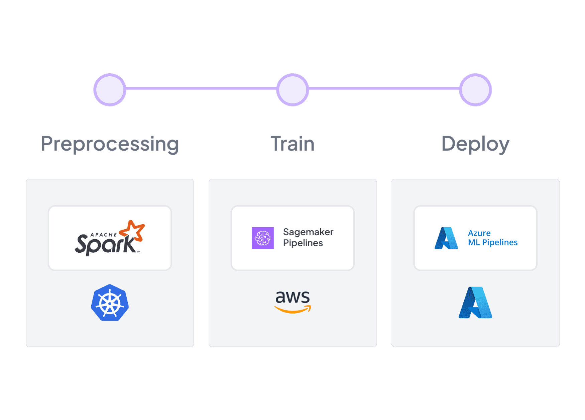

The ZenML production guide builds upon the [Starter guide](starter-guide.mdx) and is the next step in the MLOps Engineer journey with ZenML. If you're an ML practitioner hoping to implement a proof of concept within your workplace to showcase the importance of MLOps, this is the place for you.
<Frame caption="ZenML simplifies development of MLOps pipelines that can span multiple production stacks.">
  
</Frame>

This guide will focus on shifting gears from running pipelines _locally_ on your machine, to running them in _production_ in the cloud. We'll cover:

<CardGroup cols={2}>
  <Card title="Deploying ZenML" icon="rocket" href="production-guide/deploying-zenml.mdx" horizontal/>
  <Card title="Understanding stacks" icon="layer-group" href="production-guide/understand-stacks.mdx"horizontal />
  <Card title="Connecting remote storage" icon="database" href="production-guide/remote-storage.mdx" horizontal/>
  <Card title="Orchestrating on the cloud" icon="cloud" href="production-guide/cloud-orchestration.mdx"horizontal />
  <Card title="Configuring the pipeline to scale compute" icon="sliders" href="production-guide/configure-pipeline.mdx" horizontal/>
  <Card title="Configure a code repository" icon="code-branch" href="production-guide/connect-code-repository.mdx" horizontal/>
</CardGroup>

Like in the starter guide, make sure you have a Python environment ready and `virtualenv` installed to follow along with ease. As now we are dealing with cloud infrastructure, you'll also want to select one of the major cloud providers (AWS, GCP, Azure), and make sure the respective CLIs are installed and authorized.

By the end, you will have completed an [end-to-end](production-guide/end-to-end.mdx) MLOps project that you can use as inspiration for your own work. Let's get right into it!

